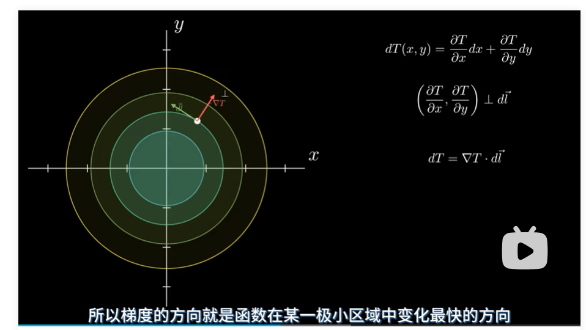
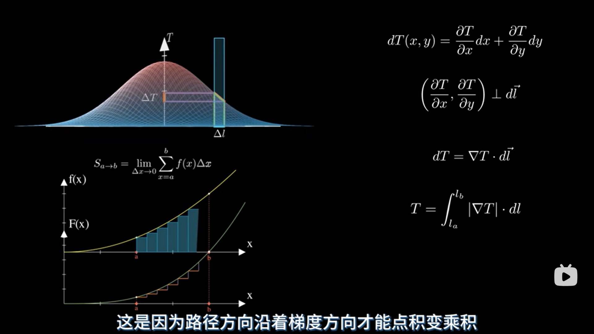
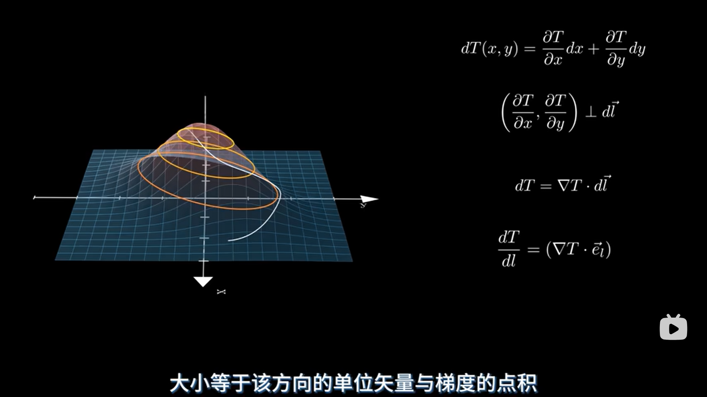

# 梯度

## 梯度的方向

 

## 梯度的计算

 

说明：如果路径方向和梯度方向一致，则为点积

不同方向的梯度（通过该方向的单位向量）



dT/dl这个算的是变化率

## 关于计算梯度的代码（先看懂，记下来）

### 以下是计算一维梯度的代码

```python
import torch

# 1. 定义一个需要求梯度的张量
x = torch.tensor(3.0, requires_grad=True)

# 2. 定义一个函数 (y = x^2)
y = x ** 2

# 3. 触发反向传播，计算梯度
y.backward()

# 4. 打印梯度 (dy/dx = 2x, 当x=3时，梯度为6)
print(f"PyTorch 计算的梯度: {x.grad}") 
```

分析：

1. 定义一个梯度张量、
   1. 3.0决定你的输入内容
   2. `requires_grad=True`这个是在反向传播过程中true是需要遍历计算的（W,R）
2. 反向传播 `backward()` **= 自动寻找路径 + 链式求导 + 梯度累加 + 内存清理**
   1. 自动寻找路径：`requires_grad=True`
   2. 链式求导：数学
   3. 梯度累加 `x.grad = x.grad + new_grad`
   4. 内存清理
3. 注意：此处的张量必须是浮点数和复数数据 ，否则（RuntimeError: Only Tensors of floating point and complex（复数） dtype can require gradients）

### 这个是输入为向量的计算梯度的代码

```python
import torch

# 1. 将 x 定义为向量
x = torch.tensor([1.0, 2.0, 3.0], requires_grad=True)

# 2. 进行计算，y 此时也是一个向量 [1, 4, 9]
y = x ** 2

# 3. 【关键步骤】将向量 y 变成标量（求和）
y_sum = y.sum() 

# 4. 对标量求导
y_sum.backward()

# 5. 打印梯度
# y_sum = x1^2 + x2^2 + x3^2
# 梯度 dy_sum/dx = [2*x1, 2*x2, 2*x3] = [2, 4, 6]
print(f"梯度: {x.grad}")
```

核心：`y_sum = y.sum()` ，`y_sum = x1^2 + x2^2 + x3^2` 这样的一个结果，将需要求的函数相加，然后不同输入对应的就是不同的xi；

说明：这个求和后的函数也称之为loss

### 标量/矢量梯度求法

#### 标量

```python
import torch

x = torch.tensor([1.0, 2.0], requires_grad=True)
y = ( x + 2 ) ** 2
z = y.mean() # 函数的线性组合 
print( z ) # tensor(12.5000, grad_fn=<MeanBackward0>)
z.backward()
print( x.grad ) # tensor([3., 4.])
```

说明：

1. `z = y.mean()` 把这个理解为函数的一个线性组合就行；
2. `z = y.mean()`需要判断这里的z是什么量，打印出来是 `tensor(12.5000, grad_fn=<MeanBackward0>)` ，可以直接用 `.backward()` ，如果不是标量见下

#### 矢量

```python
import torch

x = torch.tensor([1.0,2.0,3.0], requires_grad=True)
y = ( x + 2 ) ** 2
z = y * 4
print( z ) # tensor([ 36.,  64., 100.], grad_fn=<MulBackward0>
z.backward()
print( x.grad )
```

说明：

1. `z = y * 4`这里的z不是标量，打印结果 `tensor([ 36.,  64., 100.], grad_fn=<MulBackward0>` 是一个向量，向量是不能直接 `.backward()`
   1. 这里为什么不是标量？
      1. 和返回值有关，上面的mean()返回的就是一维的平均值，这里x不同对应的y不同，输入时向量，输出必然也是向量
   2. 不能 `.backward()` 该怎么办？
      1. `z.backward(torch.tensor([1.0, 1.0, 1.0]))` 我们计算完z的结果后，z是一个3*1的向量，我们就需要传递一个与 `z` 形状相同的“梯度权重”参数
      2. 数学上，这就好比时1*$dz/dx$，这里的“1”就是默认权重
   3. 有没有不同权重的情况？
      1. 这个权重参数代表“我对z中每个元素的重视程度”
      2. 关于这个权重的修改，在当今这个框架中与在loss层改变参数是等价的

高纬度计算梯度的代码

```python
# 高维输入 -> 复杂模型 -> 高维输出(损失向量) -> 求和/求平均 -> 反向传播
loss = criterion(output, target) # 得到高维损失
loss.sum().backward()            # 先求和，再求导 (标准做法)
```
