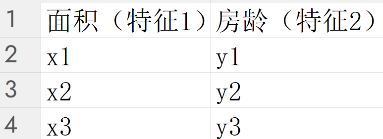
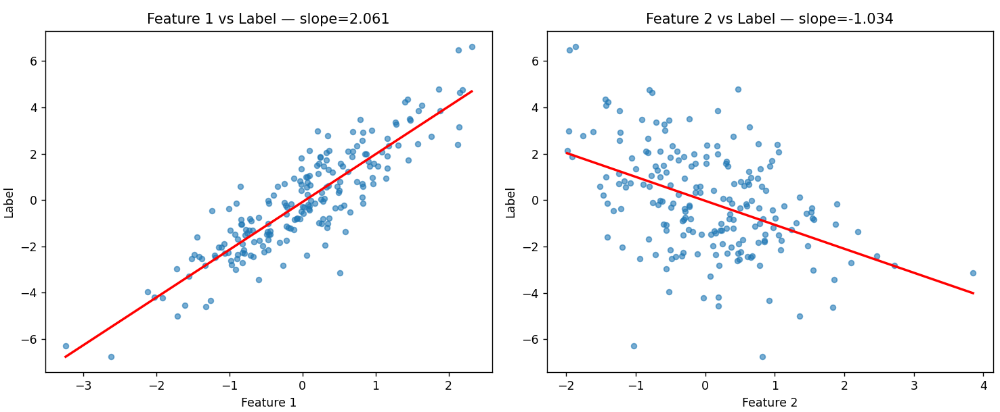

# 数据集

## 生成数据集

要求：生成一个简单的人工训练集，设训练数据集样本为1000，输入个数（特征数）为2，给定随机生成的批量样本特征X ∈ R^(1000×2)，线性回归模型真实权重w=【2，-3.4】和偏差b=4.2，以及一个随机噪声项**$*ϵ*$** ，噪声项服从均值为0，标准差为0.01的正太分布，生成数据集的python代码

分析：y = Xw + b + ϵ

样本个数为1000，特征数为2，`X ∈ R^(1000×2)`怎么理解？



data1.png

代码：

```python
import torch
# 生成数据集
def synthetic_data(w, b, num_examples):
    """生成 y = Xw + b + 噪声"""
    # 生成服从标准正态分布（均值为0，标准差为1）的随机样本特征 X
    X = torch.normal(0, 1, (num_examples, len(w)))
    # 计算线性部分 Xw + b
    y = torch.matmul(X, w) + b
    # 加上服从均值为0、标准差为0.01的正态分布噪声
    y += torch.normal(0, 0.01, y.shape)
    # 将 y 的形状转换为 (num_examples, 1) 的列向量并返回
    return X, y.reshape((-1, 1))

# 设定真实的权重 w、偏差 b 和样本数量
true_w = torch.tensor([2, -3.4])
true_b = 4.2
num_examples = 1000

# 生成数据集
features, labels = synthetic_data(true_w, true_b, num_examples)
```

1. 生成的批量样本特征X ∈ R^(1000×2)
    1. `X = torch.normal(0, 1, (num_examples, len(w)))` 生成符合正态分布的随机数据，数据形式是均值为0，标准差为1，形式为1000*2的矩阵；
        1. 这里为什么选择符合正态分布的随机数据？计算机中随机生成数据必然要符合生成规矩，正态分布又是比较符合现实的情况；
2. 线性回归模型，w和b
    1. `y = torch.matmul(X, w) + b`
        1. `matmul` torch下的矩阵乘法（不是数学中的矩阵乘法）matrix+mul，
            1. 这里为什么想到torch中的矩阵乘法？在生成数据的时候生成的是1000*2的矩阵，又是线性y = Xw + b + ϵ，既然是线性，w与x相乘必然是矩阵乘法
            2. 关于矩阵乘法：**每一个样本的特征**都与**对应的权重**进行相乘并求和；
            3. 具体实现：**torch中的矩阵乘法i = j才行，矩阵是i*j，另一个矩阵要是x*i才行**
            
            ```python
            import torch
            
            x = torch.tensor([[1, 1], [2, 2], [3, 3]])
                       # tensor([[1, 1],
                       #         [2, 2],
                       #         [3, 3]])
            w = torch.tensor([[1], [2]])
                       #tensor([[1],
                       #        [2]])
            y = torch.matmul(x, w)
            print(y)
            
            # 结果如下
            
            tensor([[3],
                    [6],
                    [9]])
            ```
            
            1. 分析：
                1. x中的第一列（第一个特征）都*1，x中的第二列（第二个特征）都*2了，不同数与对应的权重相乘；
                2. w：这里不能直接写[1，2]，因为[1，2]对应的是1*2，不匹配x的3*2（注意我们计算的是X*w）
3. 噪声项**$*ϵ*$**
    1. `y += torch.normal(0, 0.01, y.shape)`
        1. y+=：y=y+；
        2. 同生成X一样，正太分布（均值为0，标准差为0.01），形状和 `y.shape`y一样；
4. 返回值
    1. `return X, y.reshape((-1, 1))`
        1. X是和之前描述的一样
        2. `y.reshape((-1, 1)`
            1. 最终的计算结果是：1000*1的一维向量，作为标签一维向量肯定是不行的，要改成1*1000的张量；
            2. 参数说明：-1为自动计算有多少行，1为强制转换为1列；
5. 生成的数据集：
    1. `features, labels = synthetic_data(true_w, true_b, num_examples)`
        1. 数据集有特征和标签
            1. 特征：对应的就是X；
            2. 标签：就是计算后的结果；
6. 两个特征与标签的线性表现(可视化部分，我直接AI生成)



data2.png

# 读取数据集

要求：读取此数据数据代码，按批量读取数据，每个批量的特征形状为（10，2），分别对应批量大小和输入个数；标签形状为批量大小

简单说就是在两个矩阵中，矩阵1是X，矩阵2是label，找到10个为一组，分成10组

```python
import torch
import data
import random

# 定义一个手动分批的生成器函数
def data_iter(batch_size, features, labels):
    num_examples = len(features)
    # 生成从 0 到 999 的索引列表
    indices = list(range(num_examples))
    random.shuffle(indices)

    # 每次步进 batch_size
    for i in range(0, num_examples, batch_size):
        # 获取当前批次的索引切片
        batch_indices = indices[i : min(i + batch_size, num_examples)]
        # 根据索引提取数据并 yield 返回
        yield features[batch_indices], labels[batch_indices]
```

实现逻辑：

1. 根据特征的大小生成索引 `num_examples = len(features)` ；
2. 生成索引，并打乱索引

```python
indices = list(range(num_examples))
random.shuffle(indices)
```

1. 分割：`batch_size = 10`
    1. 每次选取10个索引为一组 `for i in range(0, num_examples, batch_size)`
        1. 参数说明：
            1. i从0开始，`num_examples` 结尾，包头不包尾，
                1. 第一轮i：`features[0:10]`，
                2. 第二轮：`features[10:20]`，
                3. 第三轮：`features[20:30]`。。。
                4. 加了 `random.shuffle(indices)`随机化后就是不是0:10就是，0~9个索引[11,8,7,6,13…]
            2. `num_examples` ：i的结尾
            3. `batch_size` ：i移动的步长
        2. `range`
            1. `range(0, num_examples, batch_size)` ：是 Python 内置的一个**序列生成函数**，它本身并不直接返回数据，而是负责生成**一系列的数字索引**
            2. 简单来讲：`range`就像一个负责喊口号的报数员，它每一轮喊出的数字 `i`，就是告诉程序：“**请从第 `i` 行开始，往后切出 10 个样本作为当前的一个批次**
    2. `batch_indices = indices[i : min(i + batch_size, num_examples)]` 索引的切片范围，从i开始，到 `i + batch_size` /`num_examples` 其中较小的一个，取最小的目的是为了防止越界，这里只是求出了需要切的索引范围；
    3. `yield features[batch_indices], labels[batch_indices]` 切割语句，实际上进行的是“匹配”操作
        1. `features[batch_indices]` ：从完整的特征矩阵 `features`（形状为 1000行2列）中，精准提取出 `batch_indices` 对应的那些行。提取出的结果就是当前批次的特征，形状为 **(10, 2)；**
        2. `labels[batch_indices]` ：从完整的标签向量 `labels`（形状为 1000行1列）中，提取出相同索引对应的标签。提取出的结果就是当前批次的标签，形状为 **(10, 1)**
        3. yield：进行一个打包操作，讲这两组数据进行打包，即“匹配”，feature与label匹配后打包为一个整体；

# 初始化模型参数

那些模型参数是需要初始化的，w和b，w和b为什么要初始化，最初在建立数据集的时候不是已经确定了w和b吗？为什么还要初始化？

1. 最初建立数据集的时候用的是w_true和b_true，因为要建立数据集必然是要用真实参数来建立数据集，而我们模型在有数据集之后，要根据数据里预测w和b，最初要带入一个线性方差y = Xw + b + ϵ，而这个方程带入的数据就是初始化数据
2. 如何初始化？
    1. 初始化代码
        
        ```python
        import torch
        import numpy as np
        import data 
        
        num_inputs = data.x.shape[1]
        
        w = torch.normal(0,0.01,size=(num_inputs,),requires_grad=True)
        b = torch.zeros(size=(1,),requires_grad=True)
        
        w.backward()
        b.backward()
        ```
        
    2. 既然要和X进行矩阵乘法（[i，j]*[j，x]），需要调整w的格式，X为[1000，2]，需要将w设置为[2，x]，参考生成数据集代码
        
        ```python
        		# 生成服从标准正态分布（均值为0，标准差为1）的随机样本特征 X
            X = torch.normal(0, 1, (num_examples, len(w)))
            # 计算线性部分 Xw + b
            y = torch.matmul(X, w) + b
        ```
        
    3. `w = torch.normal(0,0.01,size=(num_inputs,),requires_grad=True)` 
        1. `.normal(0,0.01` ：正态分布：均值为0，标准差为0.01；
        2. `size=(num_inputs,)` ：格式设置，`data.x.shape[1]` 取的是X中的列数即特征数
            1. `.shape[1]` ：取列数；
            2. `.shape[0]` ：取行数；
        3. `requires_grad=True)` ：告诉计算机这个是需要学习的参数；
    4. `b = torch.zeros(size=(1,),requires_grad=True)` 
        1. `.zeros` ：将b设置为全0；
        2. `size=(1,)` ：由于`.matmul(X, w)` 的出的共1000个一维数字，通过广播机制，b与这1000个数字相加；
            1. `.matmul(X, w)` 输出的是什么？
                1. 输出的是：`(1000,)` **不是指 1000 行**，而是指**只有 1 个维度，这个维度里有 1000 个元素**。
                2. `(1000,)` 与 `1，1000）` 区别
                    1. `(1000,)` ：元组里**只有 1 个数字和 1 个逗号**，代表这是一个**一维张量**（向量）。你可以把它想象成**平铺在桌面上的一排 1000 个格子**。
                    2.  **`(1, 1000)`**：**2 个数字**，代表这是一个**二维张量**（矩阵）。这是**1 行 1000 列**，可以想象成**横着的一条细长带子**。
            2. 为什么 `torch.matmul` 算出来是 `(1000,)` 而不是 `(1000, 1)` ？
                1. 当它计算 (1000, 2) 的矩阵和 (2,) 的向量相乘时，内部确实会先按 (1000, 2) × (2, 1) 算出 (1000, 1) 的结果。**但是，PyTorch 觉得这个长度为 1 的尾巴（列维度）有点多余，就会自动把它“挤压”（squeeze）掉，直接给你一个更干净的一维张量 (1000,)。**
            3. **总结：`(1000,)` 就是一排单纯的 1000 个数据；而 `(1, 1000)` 是把它包在了一个二维的盒子里，强行规定它是“1行”。**
        3. `requires_grad=True)` ：告诉计算机这个是需要学习的参数；
3. 为什么w初始化的时候要求的是正态随机分布，而b不需要
    1. w，b设为0时
        - **神经元1**：输出 = 激活函数(0 * 输入 + 0) = 0
        - **神经元2**：输出 = 激活函数(0 * 输入 + 0) = 0
            1. 无论输入是什么，这两个神经元输出的结果**完全一模一样，这两个神经元永远在学一模一样的东西，做着完全相同的计算，就没有必要有两个神经元参与运算了，w，b为0导致神经元“瞎了”，只能输出一个固定的死值；**
    2. w为a，b为0时
        - **神经元1**：输出 = 激活函数(a * 输入 + 0) = 0
        - **神经元2**：输出 = 激活函数(a * 输入 + 0) = 0
            1. 这两个神经元输出的结果**完全一模一样，就没有必要有两个神经元参与运算了；**
    3. w不同，b相同时
        - **神经元1**：输出 = 激活函数(0.5 * 输入 + 0)
        - **神经元2**：输出 = 激活函数(-0.3 * 输入 + 0)
            1. 虽然 b 都是 0，但因为 **w 已经不一样了**，这两个神经元算出来的结果从一开始就不同了！既然输出不同，反向传播算出来的梯度也就不同，在更新参数时，两个神经元就会朝着不同的方向进化，各自学习数据中不同的规律。
    4. w相同，b不同时，会产生如下几种问题
        1. **避免激活函数“饱和”，防止梯度消失：**这是最致命的原因。神经网络常用的激活函数（比如 Sigmoid 或 Tanh）在输入值非常大或非常小的时候，曲线会变得极其平坦（也就是进入了“饱和区”），此时梯度几乎为 0。
            1. 把 b 设为 0，配合微小的随机 w，能保证神经元的初始输出刚好落在激活函数最敏感、梯度最大的区域，让模型起步最快
        2. **权重 w 才是真正“干活”的主角**
            1.  **权重 w** 决定了模型如何看待输入数据的各个特征（比如识别图片时，哪个像素重要，哪个不重要）。它是模型表达能力的绝对核心，必须通过随机初始化来让每个神经元从不同的“视角”去观察数据。
            2.  **偏置 b** 仅仅是一个平移量（相当于给神经元设个门槛）。在 `w` 已经随机化、打破了观察视角的前提下，b 从 0 开始是最公平、最稳妥的起点。
4. 通俗理解：
    1. 理解一：
        - **权重（w）** 像是每个学生的**“听课专注度”**。如果专注度全是0，那老师（输入X）讲什么他们都听不进去，全班学生表现一模一样（全在发呆）。
        - **偏置（b）** 像是每个学生的**“基础分”**。把基础分设为0，但只要他们的专注度（w）不同（有的认真听，有的开小差），最后学到的东西（输出）自然也就千差万别了。
    2. 理解二：
        - **权重 w** 是每个队员手里的**“指南针”**。我们必须给每个人发一个指向不同方向的随机指南针，这样大家才能分散开，探索到地图的各个角落。
        - **偏置 b** 是队员出发时的**“起跑线位置”**。只要大家的指南针方向不同，哪怕所有人都在同一个起跑线（b=0）出发，他们也很快会走向完全不同的地方。
        - 反过来，如果你把指南针全没收了（w=0），只把大家随机空投到地图的各个角落（b 随机），虽然大家位置不同，但因为都没有方向感（输入信号被屏蔽），整个队伍依然无法有效地完成探索任务。