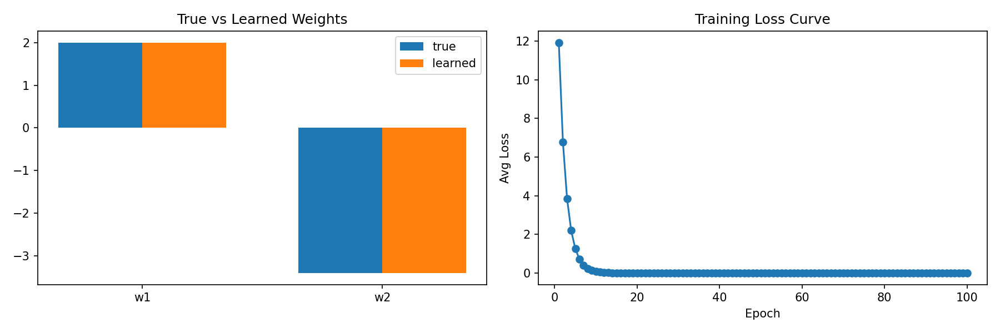

# 模型

# 定义模型

1. 代码：同生成数据时用的代码 `y = torch.matmul(X, w) + b`

   ```python
   import torch

   def linreg(X, w, b):
       """
       线性回归模型的前向传播函数
       X: 输入特征 (形状如 [10, 2])
       w: 权重 (形状如 [2,])
       b: 偏置 (形状如 [1,])
       """
       return torch.matmul(X, w) + b
   ```

# 定义损失函数

1. 代码：需要注意就是y的形状要与y_hat形状一致就行；

   ```python
   import torch

   def squared_loss(y_hat, y):
       """
       均方损失函数
       y_hat: 模型的预测值（一维张量，如形状 [10]）
       y: 真实标签（可能需要调整形状以匹配 y_hat）
       """
       # 将真实值 y 的形状调整为和预测值 y_hat 完全一致，防止形状不匹配报错
       return (y_hat - y.reshape(y_hat.shape)) ** 2 / 2
   ```

# 定义优化算法

1. 代码：

   ```python
   def sgd(params, lr, batch_size):
       """
       小批量随机梯度下降优化算法
       params: 需要更新的模型参数列表，比如 [w, b]
       lr: 学习率 (learning rate)，控制每次更新的步长
       batch_size: 当前批次的大小
       """
       with torch.no_grad():  # 1. 告诉 PyTorch：更新参数时不需要计算梯度，也不需要记录计算图
           for param in params:
               # 2. 核心更新公式：参数 = 参数 - 学习率 * (参数的梯度 / 批次大小)
               param -= lr * param.grad / batch_size
               # 3. 梯度清零：防止下一次计算时，梯度会累加到这一次的梯度上
               # param.grad.zero_()
   ```
2. 线性回归是怎么进行学习的，以及具体细节是如何？

   1. 怎样学习的？具体过程如下
      1. 首先使用初始化的w和d，带入数据，计算loss，loss未收敛，根据梯度公式，梯度的方向是使函数变化最大的方向，反方向就是我们需要的，通过梯度下降公式 `param -= lr * param.grad / batch_size` 更新了一组新的w和d，梯度清零；
      2. 有了新的w，d继续1，继续更新即可；
   2. loss合适收敛
      1. **看 Loss 的变化曲线**：在训练初期，Loss 会下降得非常快。随着训练的进行，Loss 的下降速度会越来越慢，直到在某一个数值附近**趋于平缓，几乎不再变化**。当我们发现连续很多次迭代 Loss 的下降幅度微乎其微（比如小于一个极小的阈值，如 0.001）时，就可以认为模型已经收敛了。
      2. **看梯度的大小**：梯度下降的本质是沿着坡度下山。当 Loss 接近最低点（谷底）时，坡度会变得非常平缓，此时计算出的梯度（`param.grad`）会**无限接近于 0**。当梯度小到一定程度，说明再往前走也降不了多少了，就可以停止训练。
      3. **设定最大迭代次数（Epoch）**：为了防止模型一直卡住停不下来，我们通常会提前设定一个最大的训练轮数（比如训练 100 轮）。时间到了就强制停止，取当前最好的结果。
   3. 专业语言：
      1. **前向传播（算 Loss）**：把当前的数据带入模型，用当前的参数（ *w* 和 *b* ）算出一个预测值，然后根据预测值和真实值的差距，求出当前的 Loss。
      2. **反向传播（求梯度）**：根据这个 Loss，利用链式法则反向求出当前 *w* 和 *b* 对应的梯度（也就是你提到的“通过梯度求出方向”）。这个梯度告诉了我们参数应该往哪个方向调整才能让 Loss 下降。
      3. **参数更新（梯度下降公式）**：利用你熟悉的公式 `w = w - lr * grad`，算出**新的一组** *w* 和 *b* 。
      4. **循环迭代**：带着这组更新后的新参数，再次回到第 1 步，带入数据计算新的 Loss，再求新的梯度，再更新参数……
   4. 关于SGD小批量随机梯度下降（Mini-batch SGD）
      1. **前向传播（Forward）：算出 Loss，注意细节**：在小批量（Mini-batch）中，我们前向传播时只把**这一小批数据**丢进模型，算出来的也是这个数据的平均 Loss。
      2. SGD的做法：根据刚才那 些小批量数据 的 Loss，反向推导出梯度，然后立刻用这个梯度去更新模型的参数（w 和 b）
   5. 如何计算梯度，以及如果更新梯度？
      1. 计算梯度：要明确梯度对应的就是偏导，求谁的偏导，毫无疑问就是loss对于w与d求偏导，在求偏导之前先求loss，看loss是否收敛；
      2. 求偏导：$\frac{\partial L}{\partial w} = \frac{\partial L}{\partial y\_hat} \cdot{\frac{\partial y\_hat}{\partial w}}$链式法则，实际上就是求loss对于w与d的偏导，这个偏导的值就是要更新的方向和偏移量；
      3. 更新参数：`param -= lr * param.grad/ batch_size` ，通过公式更新参数；
3. 关于梯度清0：`param.grad.zero_()` 这个代码非常重要防止梯度累加，但是清0的这个逻辑往往是在训练代码中执行的，这里不做清0操作；

# train代码

```python
import torch
from generate_data import features, labels, true_w, true_b
from readdata import data_iter
from init import w, b
from model import linreg
from loss_model import squared_loss
from SGD import sgd
from visualize_features import plot_training_results

# --- 超参数设置 ---
batch_size = 10
lr = 0.03
num_epochs = 100
# --- 为了可视化记录 ---
epoch_losses = []

# --- 训练主循环 ---
for epoch in range(num_epochs):
    total_loss = 0
    num_batches = 0

    for X, y in data_iter(batch_size, features, labels):
        # --- 1. 前向传播 ---
        y_hat = linreg(X, w, b)
        loss = squared_loss(y_hat, y).mean() # 转为标量

        # --- 2. 梯度清零 (关键：因为 SGD.py 里删掉了，这里必须加) ---
        # PyTorch 默认会累加梯度 (accumulate)，所以每次 backward 前必须手动清零
        # 否则本次梯度 = 本次计算 + 上次残留，会导致参数乱飞
        if w.grad is not None:
            w.grad.zero_()
        if b.grad is not None:
            b.grad.zero_()
    
        # --- 3. 反向传播 ---
        loss.backward() # 自动计算梯度，填入 w.grad 和 b.grad
    
        # --- 4. 参数更新 ---
        # 调用 SGD，它只做减法，不再清零
        sgd([w, b], lr, batch_size)
    
        total_loss += loss.item()
        num_batches += 1

    # --- 记录与打印 ---
    avg_loss = total_loss / num_batches
    epoch_losses.append(avg_loss)
  
    if (epoch + 1) % 20 == 0:
        print(f'Epoch [{epoch+1}/{num_epochs}], Loss: {avg_loss:.6f}')

print('\n训练完成！')
print(f'真实权重 w: {true_w}')
learned_w = w.detach().numpy().reshape(-1)
print(f'学习到的 w: {learned_w}')
print(f'真实偏置 b: {true_b}')
print(f'学习到的 b: {b.item():.4f}')

# 绘图
plot_training_results(true_w.numpy(), learned_w, epoch_losses)
```

关于可视化：可视化内容比较多比较难，主要靠vibe coding，这一部分我只能做到可以提要求，以及由图像提改进

代码说明：实际上落实到数据传入后怎么交互，我们现在准备好的就是已经分割好批次的数据

1. 双for循环

   ```python
   for epoch in range(num_epochs):
       total_loss = 0
       num_batches = 0

       for X, y in data_iter(batch_size, features, labels)
   ```
2. 第一个for循环是轮次：就是所有数据集需要训练多少次

   1. 代码 `for epoch in range(num_epochs)` 中的 `range(num_epochs)` 目的是为了方便修改；
3. 第二个for循环是批次（1.要训练所有数据，2.for循环完成就是完成了一个Epoch）：分好了的数据按批次训练，比方说原始数据被分成了10批次，然后for就是执行这10批次

   1. 代码 `for X, y in data_iter(batch_size, features, labels)` 配合 `yield` 组成生成器函数，与 `fori`的区别在于，`fori` 是以数为循环，而这里是一种“解包循环”

      ```python
      import torch
      import generate_data
      import random

      # 定义一个手动分批的生成器函数
      def data_iter(batch_size, features, labels):
          num_examples = len(features)
          # 生成从 0 到 999 的索引列表
          indices = list(range(num_examples))
          random.shuffle(indices)

          # 每次步进 batch_size
          for i in range(0, num_examples, batch_size):
              # 获取当前批次的索引切片
              batch_indices = indices[i : min(i + batch_size, num_examples)]
              # 根据索引提取数据并 yield 返回
              yield features[batch_indices], labels[batch_indices]
      ```

      这段代码是分割数据的函数，使用了 `yield` 关键字，之前介绍过 `yield` 作用是相当于“匹配”，就是找一对数，思考：我们建数据的时候是[1000，2]，我们是以10个一切，就切成[10，2]，这10组数据是以索引的形式保存，取的时候通过索引去取，这样就算是随机读取，也不会打乱顺序，取一个，算一次 `y_hat = linreg(X, w, b)`，`loss = squared_loss(y_hat, y).mean()` ，`.mean()` 则是将这一批次的所有loss算出来之后求平均，然后求梯度 `loss.backward()` ，`.backward()` 这个代码的逻辑则是返回到init.py

      ```python
      w = torch.normal(0, 0.01, size=(num_inputs,), requires_grad=True)
      b = torch.zeros(size=(1,), requires_grad=True)
      ```

      `requires_grad=True` 此时产生效果告诉计算机这俩个数是需要学习的数，就是求梯度的数，求出w与b的梯度后，`sgd([w, b], lr, batch_size)`根据这个梯度SGD就可以更新梯度了，`total_loss += loss.item()` +`num_batches += 1`而这个则是为了计算平均损失率 `avg_loss = total_loss / num_batches` 方便可视化，什么时候退出第二个for循环呢？当 `data_iter（）` 函数执行到最后一步，没有新的 `yield` 可以返回时，它会抛出一个 `StopIteration` 异常。Python 的 `for` 循环捕捉到这个信号，就知道“活干完了”，于是自动退出。

# 结果展示


